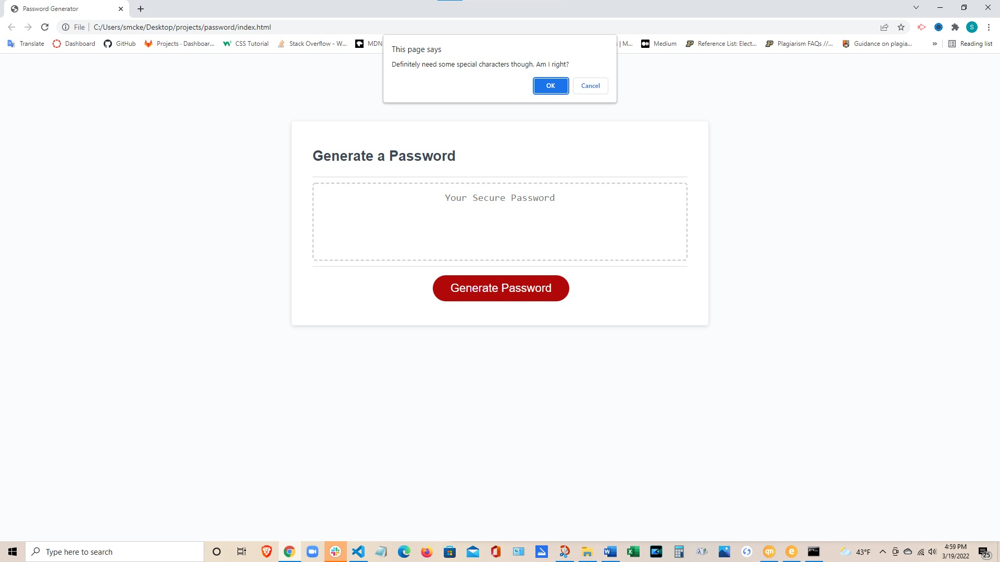
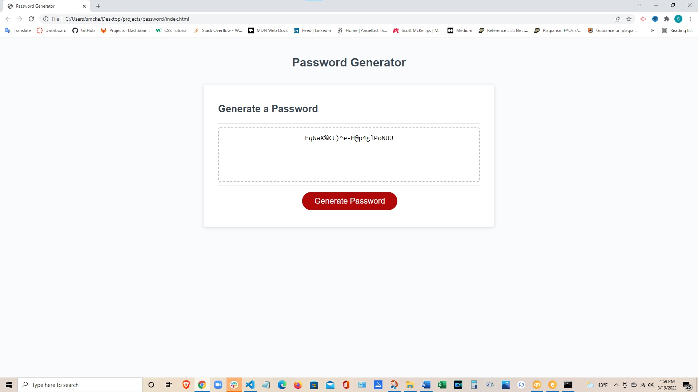

# 03 JavaScript: Password Generator

Create an application that generates a random password based on user-selected criteria. The app runs in the browser and features dynamically updated HTML and CSS powered by your JavaScript code. It has a clean and polished user interface and is responsive, which ensures that it adapts to multiple screen sizes.

## User Story

```
AS AN employee with access to sensitive data
I WANT to randomly generate a password that meets certain criteria
SO THAT I can create a strong password that provides greater security
```

## Acceptance Criteria

```
GIVEN I need a new, secure password
WHEN I click the button to generate a password
THEN I am presented with a series of prompts for password criteria
WHEN prompted for password criteria
THEN I select which criteria to include in the password
WHEN prompted for the length of the password
THEN I choose a length of at least 8 characters and no more than 128 characters
WHEN prompted for character types to include in the password
THEN I choose lowercase, uppercase, numeric, and/or special characters
WHEN I answer each prompt
THEN my input should be validated and at least one character type should be selected
WHEN all prompts are answered
THEN a password is generated that matches the selected criteria
WHEN the password is generated
THEN the password is either displayed in an alert or written to the page
```

The following images demonstrate the application functionality:






## Challenges I Faced

...
I started this project by working out a pseudocode as a foundation to the coding as follows:

    // get the password length from user --passLong--
    // get character types from user --passUp, passLow, passSpec, passNum--

    //assemble an array of random characters --passArray-- that is --passLong-- in length
        // randomly draw from one of the randomly generated character generators below --passLong number of times

    // create an array for numbers --passNum--
      // generate random number from array
    // create an array for special characters --passSpec--
      // generate random special characters from array
    // create an array for lowercase letters --passLow--
      // generate random lowercase letters from array
    // create an array for uppercase letters --passUp--
      // generate random uppercase letters from array
    // reset the generators for the next random charachter draw

As you are likely able to tell, there were difficulties with this approach and I needed help in assembling this conceptually. What I discovered is I should be able to assemble every character set into an array and draw randomly from that set, rather from individual arrays seperately. Very different from my original thought. To that end I discovered a video that basically walked through the process whose citation is below:

    // Vega, D. [Daniel Vega]. (2020, June 19.) Random Password Generator in JavaScript [Video].YouTube. https://www.youtube.com/watch?v=v2jfGo7ztm8

I did try to use different methods and processes to achieve the same result and explore the capabilities of other ideas but honestly the resulting code seems to be pretty basic to the task.

## Review

You are required to submit the following for review:

* The URL of the deployed application.

* The URL of the GitHub repository. Give the repository a unique name and include a README describing the project.

- - -
© 2022 Trilogy Education Services, LLC, a 2U, Inc. brand. Confidential and Proprietary. All Rights Reserved.
